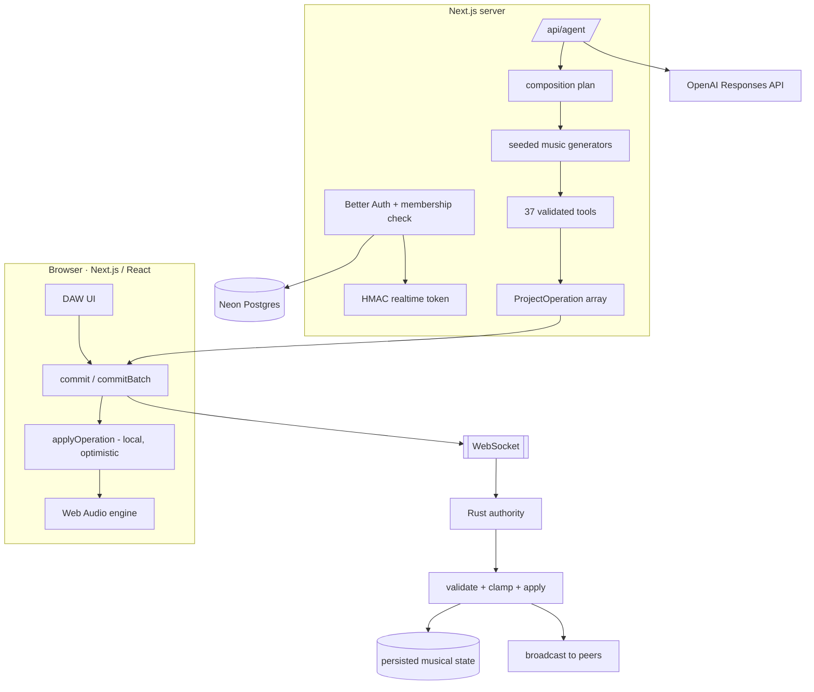

<div align="center">

# MIDICOLLAB — Web

**A real-time collaborative browser DAW with a single shared song model that humans, remote collaborators, and an AI co-producer all edit through the same operation protocol.**


[Live demo](https://mcw-ksou4kgp9-aarons-projects-0ae33486.vercel.app/) · [Realtime backend (Rust)](https://github.com/ar15spam/midicollab)

</div>

---

## Summary

MIDICOLLAB is a browser music-production environment built around one design constraint: **every edit is a `ProjectOperation`**. A human dragging a clip, a remote collaborator over WebSocket, and the AI co-producer responding to *"give me a 64-bar dark house track"* all produce the same validated, serializable operation array. That array is applied locally for zero-latency feedback, sent to a Rust authority for validation and persistence, and broadcast to every other client.

The AI is not a text-to-audio black box. A prompt becomes a **composition plan** (tempo, key/scale, groove, structure, energy curve), which drives deterministic seeded music generators, which emit the same operation protocol a human uses — so AI output is editable, attributable, and collaborative rather than a rendered file.

## By the Numbers

| | |
|---|---|
| Frontend | ~11k LOC TypeScript / React 19 / Next.js 15 |
| Realtime backend | ~1.6k LOC Rust (Axum + Tokio + WebSockets) |
| Shared operation protocol | **28 `ProjectOperation` variants**, one source of truth, mirrored + re-validated in Rust |
| AI tools | **37 validated tools** → operation arrays (never direct state writes) |
| Timeline | up to **256 bars**, bar/beat ruler, sample-accurate playhead, click-to-seek, zoom/scroll |
| Song structure | 8 section kinds (intro · groove · build · breakdown · drop · bridge · outro · custom) |
| Sound palette | 13 synth presets · 10 drum voices · 5 drum kits · 5 insert effects · parameter automation |
| Generative system | 11 drum styles · 7 bass feels · 7 melody moods · 10 chord progressions · 14 mood presets · seeded PRNG (reproducible) |
| Latency model | optimistic local apply + async server reconcile; offline op queue with replay on reconnect |
| Auth boundary | short-lived HMAC realtime token, minted by Next.js after session + membership check, independently verified by Rust |

## Architecture



**Invariant:** the client is never trusted. `applyOperation` runs locally for responsiveness, but Rust re-applies every operation with its own bounds-checking and clamping and is the source of truth on conflict. The AI path adds one more gate — the LLM can only call the 37 registered tools, each of which validates its own arguments before emitting operations.

**Stack:** Next.js 15 · React 19 · TypeScript · Web Audio API · Better Auth · Drizzle ORM + Neon Postgres · OpenAI Responses API · Rust / Axum / Tokio on Railway · frontend on Vercel.

## The AI Co-Producer

```text
make bars 17-24 a breakdown
open the filter into the drop
make the bass more syncopated but don't change the tempo
give me a 64-bar dark house track
```

Pipeline: **prompt → LLM (Responses API, tool calling) → composition plan → seeded generators → tool calls → `ProjectOperation[]` → same commit path as a human edit.**

- **Deterministic generation** — a `mulberry32` seed makes any result reproducible; regeneration with a new seed varies drums, basslines, chord voicings, and melodic motifs instead of returning the same loop.
- **Structure-aware** — the model reasons about sections and an energy curve, then places distinct clips per section (a build is not a copy of the drop).
- **Context-scoped edits** — the agent receives the selected track / clip / bar-range / section, so *"turn this into a breakdown"* acts only on the highlighted bars.
- **Offline fallback** — a regex intent matcher covers common single-intent edits with no API key.

## Realtime Collaboration

- Authenticated project rooms; presence tied to real identity (no manual usernames).
- Optimistic local apply, async server reconcile, last-writer-wins on the Rust authority.
- Offline operation queue with ordered replay on reconnect; autosave.
- Share / invite flow; public read-only project pages.

## Audio Engine

Web Audio API, custom scheduler. 13 synth presets with unison / sub-oscillator / glide, 10 synthesized drum voices across 5 kits, per-track insert chain (filter · drive · chorus · reverb · delay), sample-accurate parameter automation, swing + humanized timing.

## Engineering Challenges & Fixes

| Problem | Root cause | Fix |
|---|---|---|
| MIDI feedback loop | Same virtual port for input and output | Split into separate input / output buses |
| TCP broadcast instability (`Broken pipe`) | Blocking writes to disconnected clients | Tokio async channels, explicit rooms, then WebSockets |
| Railway deploy failures | No start command, missing ALSA headers, wrong binary path | Split out `studio_server` binary, pinned Linux audio deps, fixed build/run config |
| Browser/backend protocol mismatch | Rust rejected browser packets as invalid MIDI | Replaced raw MIDI forwarding with the `ProjectOperation` protocol |
| Better Auth / Drizzle failures | Schema + account-field version mismatches | Aligned versions/schema; Neon as source of truth for identity |
| Insecure realtime auth | Rooms trusted manually entered usernames/IDs | Short-lived HMAC token, minted server-side, re-verified independently by Rust |
| OpenAI provider failure | Legacy Chat Completions shape didn't fit the reasoning + tool workflow | Rewrote the adapter around `/v1/responses` |
| Generated music felt repetitive | Musical model was too small — not a prompting problem | Expanded the system: variable-length sections, seeded generators, 11 drum styles, chord progressions, motif-based melodies |

## Running Locally

Requires Node.js + npm, a running [Rust backend](https://github.com/ar15spam/midicollab), a Neon database, and Better Auth secrets.

```env
OPENAI_API_KEY=...
AGENT_PROVIDER=openai
AGENT_MODEL=gpt-5.6-luna
AGENT_REASONING_EFFORT=low
```

```bash
npm install
npm run dev
```

On Vercel, set environment variables in project settings — `.env.local` is not transferred. When `ProjectState` / `ProjectOperation` changes, deploy the backend and frontend together (the wire protocol is shared).

## Roadmap

- **P0 — Safe AI edits:** undo/redo, one-click "undo AI change," revision history
- **P1 — Portability:** export MIDI / WAV / stems
- **P2 — Direct editing:** better piano roll, multi-select, velocity editing, visual automation lanes, sub-bar clip moves
- **P3 — Sound quality:** searchable preset/sample library, EQ, compressor, sidechain, limiter
- **P4 — Collaboration:** comments, @mentions, human/AI activity feed, project versions/forks
- **P5 — Audio workflows:** audio tracks, mic recording, waveform editing, time-stretch/pitch

## Product Thesis

Not competing with Ableton on features or with text-to-audio companies on raw generation.

> You, your collaborators, and an AI co-producer make editable music together in the same browser project.

The planned differentiator is an AI that explains production problems, not only generates:

```text
"Why doesn't this drop hit?"

"The bass enters before the drop, reducing contrast. I can remove it
for the final bar, add a drum fill, and bring it back on the downbeat."

[Apply]
```

---

**Backend:** [ar15spam/midicollab](https://github.com/ar15spam/midicollab) — Rust / Axum / Tokio realtime state authority
**License:** MIT · **Status:** Active development
