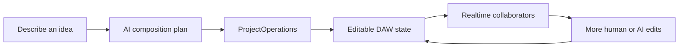
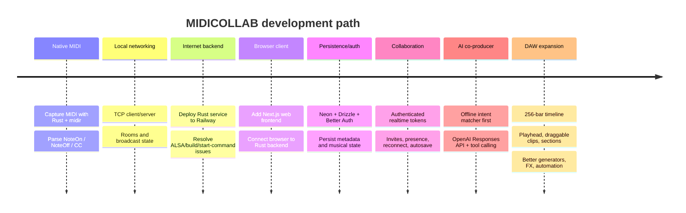
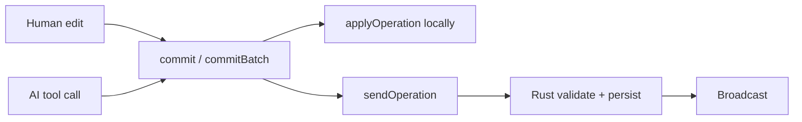

<div align="center">

# MIDICOLLAB — Web

**A collaborative browser DAW where people and an AI co-producer edit the same structured song, in real time.**


[Live demo](https://mcw-ksou4kgp9-aarons-projects-0ae33486.vercel.app/) | [Realtime backend repo](https://github.com/ar15spam/midicollab)

</div>

---

## At a Glance

| Metric | Value |
|---|---|
| Max project length | 256 bars |
| Song section types | 7 (intro, groove, build, breakdown, drop, bridge, outro) |
| Built-in audio effects | 5 (filter, drive, chorus, reverb, delay) |
| Edit sources sharing one project model | 3 (human, remote collaborator, AI) |
| Status | Active development |

## Product Idea

MIDICOLLAB combines a browser DAW, realtime multiplayer collaboration, persistent projects, and an AI co-producer that edits the actual project state — not a separate rendered audio file.



The human user, collaborators, and the AI share one representation: tracks, clips, notes, sections, instruments, effects, and automation. That single decision is why AI edits are collaborative instead of a bolted-on feature (see [ProjectOperation](#core-architecture-decision-projectoperation)).

## Contents

- [Current Capabilities](#current-capabilities)
- [Architecture](#architecture)
- [Development Timeline](#development-timeline)
- [Engineering Challenges & Fixes](#engineering-challenges--fixes-8-solved)
- [Core Architecture Decision: ProjectOperation](#core-architecture-decision-projectoperation)
- [Development Workflow](#development-workflow)
- [Running Locally](#running-locally)
- [Roadmap](#roadmap)
- [Product Thesis](#product-thesis)

---

## Current Capabilities

**Browser DAW** — variable-length projects up to 256 bars, bar/beat ruler with moving playhead, click-to-seek, zoom/scroll, draggable/resizable clips, loop regions, swing/humanize/quantize, and 7 song section types (intro, groove, build, breakdown, drop, bridge, outro).

**AI co-producer** — natural-language edits translated into the same operation protocol a human uses:

```text
make bars 17-24 a breakdown
make the bass more syncopated
open the filter into the drop
give me a 64-bar dark house track
make the drums more energetic but don't change tempo
```

**Realtime collaboration** — authenticated project rooms, presence tied to real identity, reconnect/offline queue, persistent projects, share/invite, public read-only pages.

**Audio engine** — Web Audio API, multiple synth presets/drum kits, 5 effects (filter, drive, chorus, reverb, delay), automation, unison, sub oscillator, glide.

## Architecture

```mermaid
flowchart TD
    U[Browser / Next.js] --> AUTH[Better Auth]
    AUTH --> DB[(Neon Postgres)]

    U --> AGENT[/api/agent]
    AGENT --> LLM[OpenAI Responses API]
    LLM --> TOOLS[Validated agent tools]
    TOOLS --> OPS[ProjectOperation array]

    OPS --> LOCAL[Local applyOperation]
    OPS --> WS[WebSocket]
    WS --> RUST[Rust realtime backend]
    RUST --> STORE[Persistent musical state]
    RUST --> OTHER[Other collaborators]

    LOCAL --> AUDIO[Web Audio engine]
    OTHER --> AUDIO
```

The AI never mutates state directly — it calls validated tools that emit the same `ProjectOperation[]` array a human edit would, which then flows through the identical apply/WebSocket/Rust-validation path.

**Stack:** Next.js 15, React 19, TypeScript, Web Audio API, Better Auth, Drizzle ORM + Neon Postgres, OpenAI Responses API, Rust/Axum backend on Railway, frontend on Vercel.

## Development Timeline



## Engineering Challenges & Fixes (8 solved)

| # | Problem | Root cause | Fix |
|---|---|---|---|
| 1 | MIDI feedback loop | Same virtual port for input and output | Split into two buses: input / output |
| 2 | TCP broadcast instability | `Broken pipe (os error 32)` on disconnect | Tokio async channels, explicit rooms, then WebSockets |
| 3 | Railway deployment failures | No start command, missing ALSA headers, wrong binary path | Split out `studio_server`, installed Linux audio deps, fixed build/run config |
| 4 | Browser/backend protocol mismatch | Rust rejected packets from the first browser client as invalid MIDI | Replaced raw MIDI forwarding with `ProjectOperation` |
| 5 | Better Auth / Drizzle failures | Schema/version and account-field mismatches | Aligned versions/schema; Neon as source of truth for identity |
| 6 | Insecure realtime auth | Rooms relied on manually entered usernames/IDs | Short-lived HMAC token, re-verified independently by Rust |
| 7 | OpenAI provider failure | Legacy Chat Completions shape didn't fit the tool/reasoning workflow | Rewrote the adapter around `/v1/responses` |
| 8 | Generated music sounded repetitive | DAW's musical sandbox was too small, not a prompting problem | Expanded the generative system: variable-length sections, seeded generators, more drum/bass styles, chord progressions, motif-based melodies |

Full authentication handshake diagram is in the [backend README](https://github.com/<your-username>/midicollab-backend#authentication-flow).

## Core Architecture Decision: ProjectOperation

Every meaningful edit — human or AI — goes through the same pipeline:



This is the single decision that makes AI edits collaborative, attributable, and eventually undoable/versionable instead of a separate side feature.

## Running Locally

Requires Node.js + npm, a running [Rust backend](https://github.com/<your-username>/midicollab-backend), a Neon database, and Better Auth secrets.

```env
OPENAI_API_KEY=...
AGENT_PROVIDER=openai
AGENT_MODEL=gpt-5.6-luna
AGENT_REASONING_EFFORT=low
```

```bash
npm install
npm run dev
```

On Vercel, environment variables must be added in project settings — `.env.local` is not transferred automatically. When `ProjectState`/`ProjectOperation` changes, deploy the backend first.

## Roadmap

- **P0 — Make AI edits safe:** undo/redo, one-click "undo AI change," revision history
- **P1 — Make projects portable:** export MIDI, WAV, stems
- **P2 — Improve direct editing:** better piano roll, multi-select, velocity editing, visual automation lanes
- **P3 — Improve sound quality:** sample/preset library, better drums, EQ, compressor, sidechain, limiter
- **P4 — Strengthen collaboration:** comments, @mentions, activity feed, project versions/forks
- **P5 — Expand audio workflows:** audio tracks, mic recording, waveform editing, time stretch/pitch

## Product Thesis

MIDICOLLAB isn't trying to out-feature Ableton or out-generate text-to-audio companies.

> You, your collaborators, and an AI co-producer make editable music together in the same browser project.

A planned differentiator is an AI that explains production problems, not only generates them:

```text
"Why doesn't this drop hit?"

"The bass enters before the drop, reducing contrast.
I can remove it for the final bar, add a drum fill,
and bring it back at the downbeat."

[Apply]
```

---

**Related:** [midicollab-backend](https://github.com/<your-username>/midicollab-backend) (Rust/Axum/Tokio realtime state engine)
**License:** MIT — see [`LICENSE`](./LICENSE)
**Status:** Active development